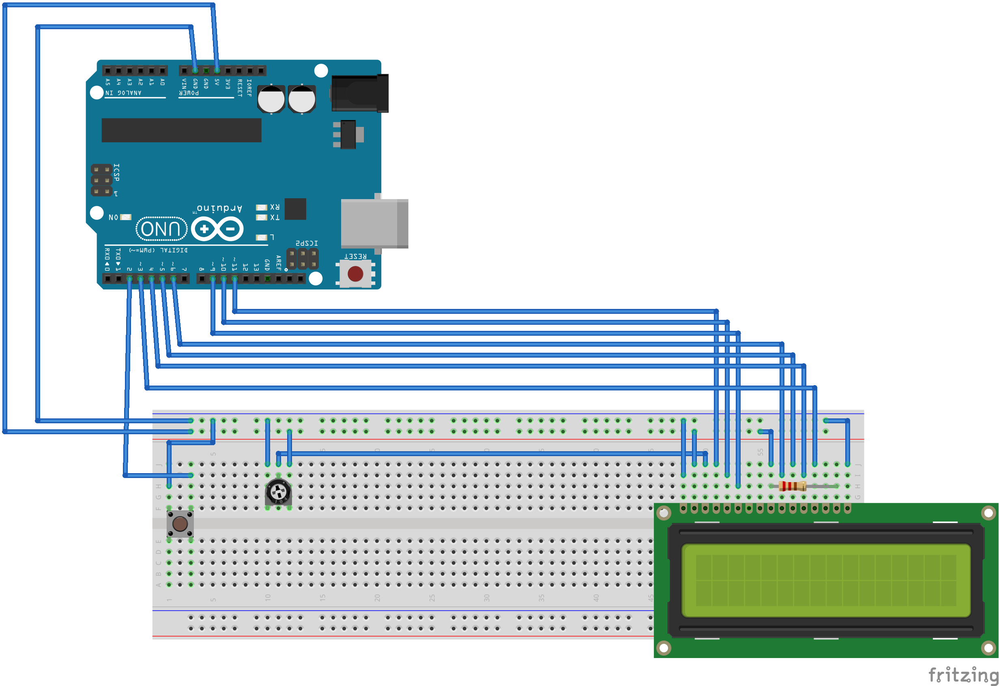

#arduino lcd game
Based off of 123D Circuits and can be simulated [here](https://123d.circuits.io/circuits/1073419-arduino-lcd-game).  
Added some [8 x 5 grid paper](8x5-Grid.pdf) to help with building the character and ground.

###arduino uno
